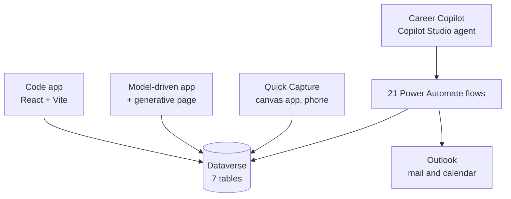

# Career Development Hub


A job-search and professional-network tracker built on Microsoft Power Platform. Seven
Dataverse tables sit behind four surfaces: a Copilot Studio agent, a React code app, a
model-driven app with a generative page, and a canvas app for phone.

## Note: A more detailed writeup on these solutions can be found on my portfolio

### [Career Development Hub](https://calebway.io/projects/career-development-hub/)
> Code App, Model-driven App, and Canvas App demonstration with pictures of the UI with real data.

### [Career Copilot](https://calebway.io/projects/career-copilot/)
> Agent demonstration with an example chat with the agent on real data.

---

## Architecture



---

## Data model

Seven tables:

- **Company** and **BusinessGroup** — organisation structure
- **NetworkingContact** and **JobApplication** — the tracked records
- **Interaction** and **FollowUp** — dated activity against them
- **ContactApplication** — many-to-many, so one person can relate to several applications

---

## The application surfaces

| Surface | Built with | Used for |
|---|---|---|
| [Code app](code-app/) | React 19, Vite, Tailwind 4, TanStack Query + Table, react-hook-form, Zod | Full CRUD, bulk edit, filtering |
| [Model-driven page](model-app/dashboard/) | Generative page, Fluent UI, `dataApi` | Stat tiles that drill into saved views |
| [Quick Capture](canvas-app/) | Canvas app, phone layout | Fast entry during a call or event |

---

## The agent

`Career Copilot` is a Copilot Studio agent on the standard harness. Its entire tool surface
is **21 typed Power Automate flows** ([`flows/definitions/`](flows/definitions/)); it has no
direct database access.

One flow in this repo is **not** part of that surface. [`flows/scheduled/daily-brief.json`](flows/scheduled/daily-brief.json)
runs on a timer at 8am and posts the day's follow-ups and calendar to Teams. It predates the
agent, isn't bound as a tool, and the agent can't call it.

The flows are typed per task rather than exposed as one generic write. From my design notes
in [`docs/FLOW-CATALOGUE.md`](docs/FLOW-CATALOGUE.md):

> Type by **task shape**, not by table — but stop before a single generic
> `DoThing(table, action, payload)`. The typed parameter list is the reliability mechanism:
> a tool that demands `contactName, companyId, relationship` cannot have its relationship
> field forgotten.

Every write is preceded by `ResolveRecord`, which returns a match confidence — `exact`,
`close`, `ambiguous`, or `none` — and [`agent/instructions.md`](agent/instructions.md) binds
a behaviour to each: use `exact`, confirm on `close`, show candidates and stop on
`ambiguous`, refuse on `none`.

The same pattern guards destructive calls. `DeleteRecord` takes a `confirmToken` and
`SendDraft` takes a `confirmSubject` that must match the real draft.

[`docs/FLOW-CATALOGUE.md`](docs/FLOW-CATALOGUE.md) also records a decision that was reversed mid-build:
email started out scoped *outside* the flow layer, then moved into it.

---

## Two problems worth reading about

**Dataverse GUIDs aren't RFC-4122.** Dataverse generates sequential GUIDs server-side whose
version nibble is `f`. The Power Apps SDK validates record ids with `uuid.validate`, which
rejects them. Records created *in the code app* passed, because the client generates a v4
uuid — but anything created by the model-driven app, the canvas app, or a flow could not be
deleted or fetched by id, failing with `The recordId is not valid for this data source`.
Fixed by overriding `isValidRecordId` in
[`dataverse-data-source-operations.ts`](code-app/app-gen-sdk/data/dataverse/dataverse-data-source-operations.ts).

This only surfaced because four surfaces write to the same tables.

**The data layer can drift from Dataverse silently.** It's hand-maintained, so a renamed or
deleted column stays in the mapping and fails at runtime — an unmapped choice is dropped with
a warning, a stale column is rejected with a generic error.
[`check-drift.mjs`](code-app/scripts/check-drift.mjs)
selects every mapped column from every table and compares choice columns against `stringmap`.
This was tested and successfully caught a column removed from the schema that was still in the mapping after manual deletion from Dataverse.

---

## How this was built

The code app started in **Power Apps Vibe** and moved out to a standalone code app for more
control over the implementation. That move wasn't optional in the end: Vibe-created apps are
locked to the Vibe authoring experience, and `pac code push` against one fails with
`AppSubtypeImmutable`. The app was recreated outside Vibe and is now developed locally with
Vite HMR plus `pac code run` for connections.

The trade is that nothing regenerates the data layer any more, which is what
`check-drift.mjs` exists to cover.

The model-driven app and canvas app were built over the same data layer to expand functionality and increase the learning
value of building this solution (which was intended to be a learning ground for me).

I worked with **Claude Code** as a development partner throughout — building parts of the apps and agents, and
working through the Power Platform issues above. This helped troubleshoot issues and accelerate development.

---

## Repo map

```
agent/        instructions, evals, and the scripts that bind flows as agent tools
flows/        21 agent tool definitions, plus the scheduled daily brief
code-app/     React code app
model-app/    generative dashboard page and four form web resources
canvas-app/   five screens of Power Fx
docs/         design notes written before the code they describe
```

**Project source** — authored for this solution. I used Claude Code as a development partner
throughout, so plenty of this was written with AI assistance and then reviewed, corrected,
and tested by me. The design decisions, the data model, and the debugging are mine.

- `agent/`, `flows/` — instructions, the 21 flow definitions, the deploy and test scripts
- `code-app/src/` — pages, hooks, lib, and the non-`ui/` components (~26 files)
- `model-app/` — the generative page and four web resources
- `canvas-app/` — five screens of Power Fx
- `docs/` — the flow catalogue and the canvas app plan, written before the code they describe

**Generated or scaffolded**, included so the app builds — not representative work:

- `code-app/src/components/ui/` — shadcn/ui primitives (53 files)
- `code-app/src/generated/` — models, services, and validators generated from the Dataverse schema (35 files)
- `code-app/app-gen-sdk/` — vendored Power Apps SDK (47 files)
- `model-app/dashboard/genpage.d.ts`, `RuntimeTypes.ts` — generated from the Dataverse schema

---

## About this repository

This is a sanitized public mirror. The working source repository is private; this one is generated by
a script that copies hand-written source, rewrites tenant identifiers to placeholders, then
re-scans its own output and fails if any GUID, org URL, email, or local path survives.
Placeholders like `<ENVIRONMENT_ID>` are that process, not omissions.

No solution export, `.msapp`, or environment state is published here. Solution version control is kept in an Azure DevOps repo.
